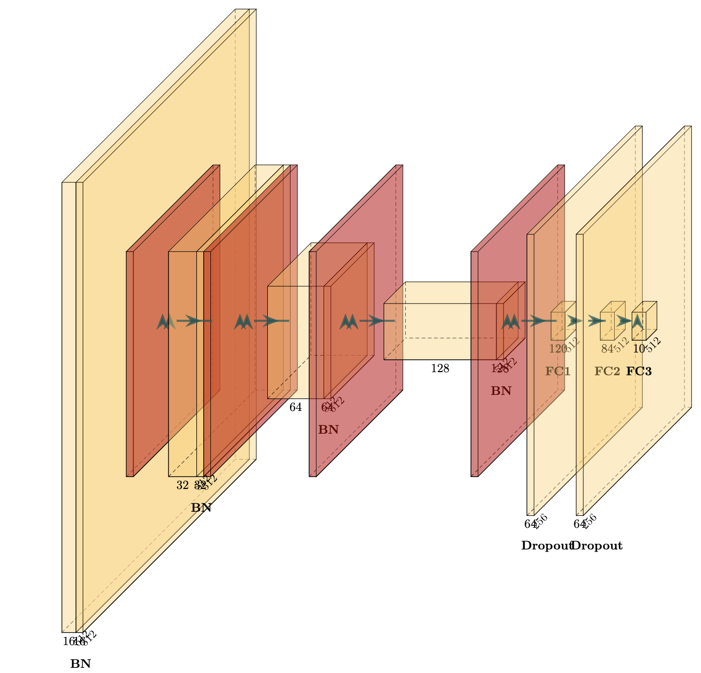

Image Classification Using CNN
--------------------------

## Overview
The objective of this project is to design and implement a Convolutional Neural Networks (CNN) for image classification on CIFAR-10. 

## Dataset
The [CIFAR-10](https://www.cs.toronto.edu/~kriz/cifar.html) dataset consists of 60,000 32x32 color images in 10 classes, with 6,000 images per class. There are 50,000 training images and 10,000 test images. 

## Benchmark
Referring to the project [cuda-convnet](https://code.google.com/archive/p/cuda-convnet/), the CNN implemented by Alex Krizhevsky in C++ achieved a test error rate of 18.2% on CIFAR-10 wihtout any image translations/transformations/preprocessing. 

## Architecture

